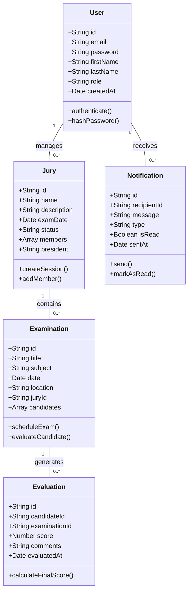
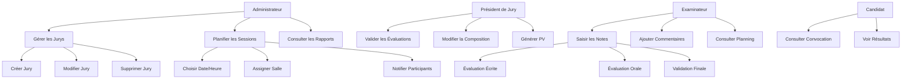
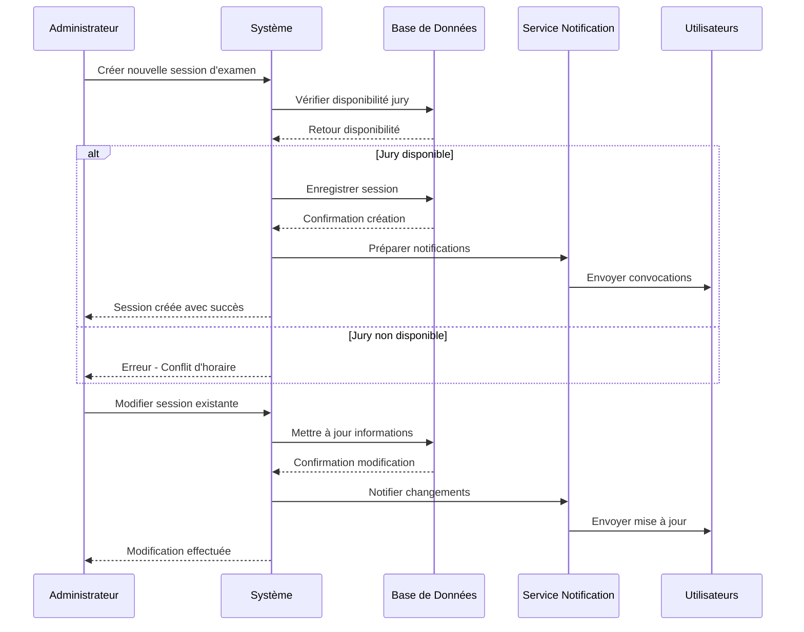

# 🎓 Jury Blanc - Système de Gestion des Jurys d'Examen

<div align="center">
  
  
  
  
  
</div>

## 📋 Description du Projet

**Jury Blanc** est une application web moderne conçue pour optimiser et automatiser la gestion des jurys d'examen dans les établissements d'enseignement. Cette solution complète permet aux administrateurs académiques de planifier efficacement les sessions d'évaluation, de gérer les membres du jury et de suivre l'ensemble du processus d'évaluation en temps réel.

Le système offre une interface intuitive pour la coordination des examens, la notification automatique des participants et la génération de rapports détaillés, contribuant ainsi à améliorer la qualité et l'efficacité du processus d'évaluation académique.

## ✨ Fonctionnalités Principales

### 👥 Gestion des Jurys
- ✅ Création et configuration des jurys d'examen
- ✅ Attribution des membres (président, examinateurs, rapporteurs)
- ✅ Gestion des compétences et spécialisations
- ✅ Historique des participations

### 📅 Planification des Sessions
- ✅ Calendrier interactif des examens
- ✅ Vérification automatique de la disponibilité
- ✅ Gestion des salles et ressources
- ✅ Planification de sessions multiples

### 📊 Suivi des Évaluations
- ✅ Interface de saisie des notes et commentaires
- ✅ Calcul automatique des moyennes
- ✅ Génération de procès-verbaux
- ✅ Validation des résultats

### 🔔 Système de Notifications
- ✅ Notifications par email automatiques
- ✅ Rappels de convocations
- ✅ Alertes en temps réel
- ✅ Notifications personnalisables

### 📈 Tableaux de Bord et Rapports
- ✅ Dashboard administrateur complet
- ✅ Statistiques en temps réel
- ✅ Export des données (PDF, Excel)
- ✅ Analyses de performance

## 🏗️ Architecture du Projet

```
jury-blanc/
├── frontend/                 # Application React.js
│   ├── public/              # Fichiers statiques
│   ├── src/
│   │   ├── components/      # Composants réutilisables
│   │   │   ├── Dashboard/   # Tableau de bord
│   │   │   ├── Jury/        # Gestion des jurys
│   │   │   ├── Exam/        # Gestion des examens
│   │   │   ├── User/        # Gestion des utilisateurs
│   │   │   └── Common/      # Composants partagés
│   │   ├── pages/          # Pages de l'application
│   │   │   ├── Login/       # Authentification
│   │   │   ├── Dashboard/   # Tableau de bord
│   │   │   ├── Juries/      # Liste des jurys
│   │   │   ├── Exams/       # Gestion des examens
│   │   │   └── Reports/     # Rapports et statistiques
│   │   ├── hooks/          # Hooks personnalisés
│   │   ├── services/       # Services API
│   │   ├── utils/          # Utilitaires
│   │   └── styles/         # Styles CSS/SCSS
│   └── package.json
├── backend/                 # API Node.js/Express
│   ├── src/
│   │   ├── controllers/    # Contrôleurs API
│   │   │   ├── auth.js     # Authentification
│   │   │   ├── jury.js     # Gestion des jurys
│   │   │   ├── exam.js     # Gestion des examens
│   │   │   ├── user.js     # Gestion des utilisateurs
│   │   │   └── report.js   # Génération de rapports
│   │   ├── models/         # Modèles MongoDB
│   │   │   ├── User.js     # Modèle utilisateur
│   │   │   ├── Jury.js     # Modèle jury
│   │   │   ├── Exam.js     # Modèle examen
│   │   │   └── Evaluation.js # Modèle évaluation
│   │   ├── routes/         # Routes API
│   │   ├── middleware/     # Middleware personnalisés
│   │   ├── services/       # Services métier
│   │   └── utils/          # Utilitaires backend
│   ├── config/             # Configuration
│   └── package.json
├── docs/                   # Documentation technique
└── README.md
```

## 🛠️ Technologies Utilisées

### Frontend
- **React.js 18.x** - Bibliothèque JavaScript pour l'interface utilisateur
- **TypeScript** - Langage de programmation typé
- **Tailwind CSS** - Framework CSS utilitaire
- **React Router** - Routage côté client
- **Axios** - Client HTTP pour les appels API
- **React Hook Form** - Gestion des formulaires
- **React Query** - Gestion du cache et des états serveur
- **Framer Motion** - Animations et transitions

### Backend
- **Node.js 18.x** - Environnement d'exécution JavaScript
- **Express.js** - Framework web minimaliste
- **MongoDB** - Base de données NoSQL
- **Mongoose** - ODM pour MongoDB
- **JWT** - Authentification par tokens
- **bcrypt** - Hachage des mots de passe
- **Nodemailer** - Envoi d'emails
- **multer** - Gestion des fichiers uploadés

### DevOps & Outils
- **Docker** - Conteneurisation
- **ESLint** - Linter JavaScript/TypeScript
- **Prettier** - Formateur de code
- **Jest** - Framework de tests
- **GitHub Actions** - CI/CD

## 📦 Installation

### Prérequis

- Node.js 18.x ou supérieur
- MongoDB 5.x ou supérieur
- npm ou yarn
- Git

### 1. Cloner le Projet

```bash
git clone https://github.com/MOUHAMEDBOUZAYAN/Jury-Blanc-.git
cd Jury-Blanc-
```

### 2. Installation Backend

```bash
# Naviguer vers le dossier backend
cd backend

# Installer les dépendances
npm install

# Copier et configurer les variables d'environnement
cp .env.example .env
# Éditer le fichier .env avec vos configurations
```

### 3. Configuration de la Base de Données

```bash
# Démarrer MongoDB (si installé localement)
mongod

# Ou utiliser Docker
docker run -d -p 27017:27017 --name mongodb mongo:5.0
```

### 4. Installation Frontend

```bash
# Naviguer vers le dossier frontend
cd ../frontend

# Installer les dépendances
npm install

# Copier et configurer les variables d'environnement
cp .env.example .env
# Éditer le fichier .env avec l'URL de l'API backend
```

## 🚀 Démarrage du Projet

### Mode Développement

```bash
# Terminal 1 - Démarrer le backend
cd backend
npm run dev

# Terminal 2 - Démarrer le frontend
cd frontend
npm start
```

L'application sera accessible à :
- **Frontend** : http://localhost:3000
- **Backend API** : http://localhost:5000

### Mode Production

```bash
# Build du frontend
cd frontend
npm run build

# Démarrage du serveur de production
cd ../backend
npm run start
```

### Utilisation avec Docker

```bash
# Construire et démarrer tous les services
docker-compose up --build

# Démarrer en arrière-plan
docker-compose up -d
```

## 📚 Documentation Technique

### 🗂️ Diagramme de Classes



### 🔄 Diagramme de Cas d'Utilisation



### 📋 Diagramme de Séquence - Planification d'Examen



### 🔌 API Endpoints

#### Authentification
```http
POST /api/auth/login          # Connexion utilisateur
POST /api/auth/register       # Inscription utilisateur
POST /api/auth/refresh        # Renouvellement token
DELETE /api/auth/logout       # Déconnexion
GET /api/auth/profile         # Profil utilisateur
```

#### Gestion des Jurys
```http
GET /api/juries              # Liste des jurys
POST /api/juries             # Créer nouveau jury
GET /api/juries/:id          # Détails d'un jury
PUT /api/juries/:id          # Modifier jury
DELETE /api/juries/:id       # Supprimer jury
POST /api/juries/:id/members # Ajouter membre au jury
```

#### Gestion des Examens
```http
GET /api/examinations        # Liste des examens
POST /api/examinations       # Planifier examen
GET /api/examinations/:id    # Détails d'un examen
PUT /api/examinations/:id    # Modifier examen
DELETE /api/examinations/:id # Annuler examen
```

#### Évaluations
```http
GET /api/evaluations         # Liste évaluations
POST /api/evaluations        # Créer évaluation
PUT /api/evaluations/:id     # Modifier évaluation
GET /api/evaluations/reports # Générer rapports
GET /api/evaluations/stats   # Statistiques
```

#### Notifications
```http
GET /api/notifications       # Liste des notifications
POST /api/notifications      # Envoyer notification
PUT /api/notifications/:id   # Marquer comme lu
DELETE /api/notifications/:id # Supprimer notification
```

## 🧪 Tests

### Structure des Tests

```
tests/
├── backend/
│   ├── unit/               # Tests unitaires
│   ├── integration/        # Tests d'intégration
│   └── e2e/               # Tests end-to-end
├── frontend/
│   ├── components/        # Tests des composants
│   ├── pages/            # Tests des pages
│   └── services/         # Tests des services
└── fixtures/             # Données de test
```

### Exécution des Tests

```bash
# Tests backend
cd backend
npm test

# Tests avec coverage
npm run test:coverage

# Tests frontend
cd frontend
npm test

# Tests end-to-end
npm run test:e2e
```

### Tests d'Intégration

```bash
# Démarrer l'environnement de test
docker-compose -f docker-compose.test.yml up

# Exécuter tests d'intégration
npm run test:integration
```

## 🚀 Déploiement

### Variables d'Environnement

#### Backend (.env)
```env
NODE_ENV=production
PORT=5000
MONGODB_URI=mongodb://localhost:27017/jury-blanc
JWT_SECRET=your-super-secret-jwt-key
JWT_EXPIRE=7d
EMAIL_HOST=smtp.gmail.com
EMAIL_PORT=587
EMAIL_USER=your-email@gmail.com
EMAIL_PASS=your-app-password
CLIENT_URL=http://localhost:3000
CORS_ORIGIN=http://localhost:3000
```

#### Frontend (.env)
```env
REACT_APP_API_URL=http://localhost:5000/api
REACT_APP_APP_NAME=Jury Blanc
REACT_APP_VERSION=1.0.0
REACT_APP_DESCRIPTION=Système de Gestion des Jurys d'Examen
```

### Déploiement Docker

```bash
# Build des images
docker-compose build

# Déploiement production
docker-compose -f docker-compose.prod.yml up -d
```

### Déploiement sur Heroku

```bash
# Créer une nouvelle application Heroku
heroku create jury-blanc-app

# Ajouter MongoDB Atlas
heroku addons:create mongolab:sandbox

# Configurer les variables d'environnement
heroku config:set NODE_ENV=production
heroku config:set JWT_SECRET=your-secret-key

# Déployer
git push heroku main
```

## 📊 Monitoring et Logs

```bash
# Consulter les logs en temps réel
docker-compose logs -f

# Logs spécifiques à un service
docker-compose logs backend
docker-compose logs frontend

# Monitoring des performances
npm run monitor
```

## 🔒 Sécurité

### Mesures de Sécurité Implémentées
- **Authentification JWT** - Tokens sécurisés avec expiration
- **Hachage des mots de passe** - Utilisation de bcrypt
- **Validation des données** - Sanitisation des entrées
- **CORS configuré** - Protection contre les attaques cross-origin
- **Limitation du taux de requêtes** - Protection contre le spam
- **HTTPS obligatoire** - Chiffrement des communications

### Bonnes Pratiques
- Utiliser des mots de passe forts
- Mettre à jour régulièrement les dépendances
- Sauvegarder régulièrement la base de données
- Surveiller les logs d'erreurs

## 🤝 Contribution

Nous accueillons les contributions de la communauté ! Voici comment participer :

### 1. Fork du Projet
```bash
git clone https://github.com/MOUHAMEDBOUZAYAN/Jury-Blanc-.git
cd Jury-Blanc-
git checkout -b feature/nouvelle-fonctionnalite
```

### 2. Standards de Code
- Suivre les conventions ESLint configurées
- Écrire des tests pour les nouvelles fonctionnalités
- Documenter les changements importants
- Utiliser des messages de commit descriptifs

### 3. Pull Request
```bash
git commit -m "feat: ajouter gestion des notes par matière"
git push origin feature/nouvelle-fonctionnalite
```

### Guidelines de Contribution
- **Code Style**: Utiliser Prettier et ESLint
- **Tests**: Maintenir une couverture de 80%+
- **Documentation**: Mettre à jour la documentation
- **Commits**: Suivre la convention [Conventional Commits](https://www.conventionalcommits.org/)

### Types de Contributions Acceptées
- 🐛 Correction de bugs
- ✨ Nouvelles fonctionnalités (gestion des notes, statistiques avancées)
- 📚 Améliorations de documentation
- 🎨 Améliorations UI/UX
- ⚡ Optimisations de performance
- 🔒 Améliorations de sécurité

## 📄 Licence

Ce projet est sous licence MIT. Voir le fichier [LICENSE](LICENSE) pour plus de détails.

```
MIT License

Copyright (c) 2024 Mouhamed Bouzayan

Permission is hereby granted, free of charge, to any person obtaining a copy
of this software and associated documentation files (the "Software"), to deal
in the Software without restriction, including without limitation the rights
to use, copy, modify, merge, publish, distribute, sublicense, and/or sell
copies of the Software, and to permit persons to whom the Software is
furnished to do so, subject to the following conditions:

The above copyright notice and this permission notice shall be included in all
copies or substantial portions of the Software.

THE SOFTWARE IS PROVIDED "AS IS", WITHOUT WARRANTY OF ANY KIND, EXPRESS OR
IMPLIED, INCLUDING BUT NOT LIMITED TO THE WARRANTIES OF MERCHANTABILITY,
FITNESS FOR A PARTICULAR PURPOSE AND NONINFRINGEMENT.
```

## 📞 Support et Contact

- **Développeur**: Mouhamed Bouzayan
- **Email**: mohammedbouzi177@gmail.com
- **LinkedIn**: [Mouhamed Bouzayan](https://www.linkedin.com/in/mouhamed-bouzayan-9a7222344/)
- **Portfolio**: [portfoliomohamedbouzayan.netlify.app](https://portfoliomohamedbouzayan.netlify.app/)

### 🐛 Signalement de Bugs

Pour signaler un bug, veuillez créer une [issue GitHub](https://github.com/MOUHAMEDBOUZAYAN/Jury-Blanc-/issues) avec :
- Description détaillée du problème
- Étapes pour reproduire
- Captures d'écran si applicable
- Environnement (OS, navigateur, version Node.js)

### 💡 Demandes de Fonctionnalités

Les suggestions d'améliorations sont les bienvenues ! Utilisez le template d'issue "Feature Request" sur GitHub.

### 📚 Documentation Supplémentaire

- [Guide d'installation détaillé](docs/installation.md)
- [Documentation API complète](docs/api.md)
- [Guide du développeur](docs/developer-guide.md)
- [FAQ](docs/faq.md)

---

<div align="center">
  <strong>Développé avec ❤️ par Mouhamed Bouzayan</strong>
  <br>
  <sub>Contribuer à l'amélioration de l'éducation par la technologie</sub>
</div>
